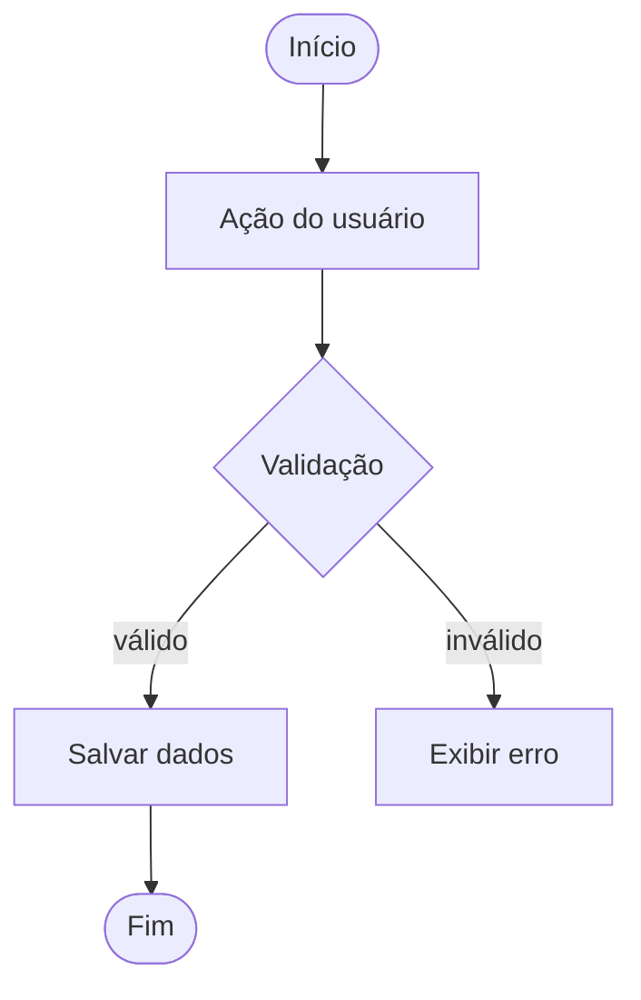
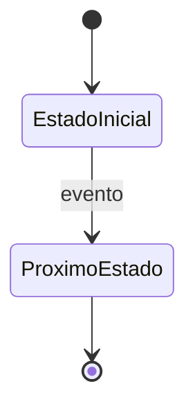

Você é um engenheiro sênior. Vou te passar informações sobre uma tarefa para criar a TechSpec.

Leia o contexto em:
- @docs/PRD_GERAL.md
- @docs/tarefas/tarefa-00X/PRD_TAREFA_00X.md

Faça as perguntas **uma de cada vez**, oferecendo sugestões em cada uma.
Aguarde minha resposta antes de continuar.

Comece agora com a pergunta 1.

---

**Pergunta 1:** Onde esta funcionalidade será implementada?

> Sugestões baseadas no projeto:
> - A) Nova tela/página independente
> - B) Componente dentro de uma tela existente
> - C) Serviço de backend (API/endpoint)
> - D) Frontend + Backend juntos
> - E) Outro — descreva

---

**Pergunta 2:** Como os dados desta tarefa serão armazenados?

> Sugestões:
> - A) Banco de dados (tabela nova)
> - B) Banco de dados (tabela existente)
> - C) Armazenamento local do navegador
> - D) Sem persistência — apenas em memória
> - E) Outro — descreva

---

**Pergunta 3:** Esta tarefa envolve comunicação entre partes distintas do sistema?
(ex: frontend chamando backend, sistema chamando API externa)

> Sugestões:
> - A) Sim — frontend chama API interna do projeto
> - B) Sim — sistema integra com API externa (ex: autenticação, pagamento, e-mail)
> - C) Não — tudo acontece dentro de uma única parte do sistema
> - D) Ainda não sei — me ajude a decidir

> ⚠️ Se responder A ou B, farei perguntas adicionais sobre o contrato da interface.

---

**[Condicional — perguntar apenas se resposta da pergunta 3 for A ou B]**

**Pergunta 3a:** Qual é a operação principal desta interface?

> Sugestões:
> - A) Criar um novo registro (POST)
> - B) Buscar dados (GET)
> - C) Atualizar um registro (PUT/PATCH)
> - D) Remover um registro (DELETE)
> - E) Mais de uma operação — descreva

---

**[Condicional — perguntar apenas se resposta da pergunta 3 for A ou B]**

**Pergunta 3b:** O que deve ser retornado em caso de erro?

> Sugestões:
> - A) Mensagem de erro genérica (ex: "Algo deu errado")
> - B) Mensagem específica por tipo de erro (ex: "E-mail já cadastrado")
> - C) Código de erro para o frontend tratar e exibir a mensagem
> - D) Outro — descreva

---

**Pergunta 4:** Quais são os maiores riscos técnicos desta implementação?

> Sugestões:
> - A) Conflito com código existente
> - B) Performance com grande volume de dados
> - C) Segurança (ex: autenticação, permissões, dados sensíveis)
> - D) Sem riscos relevantes para esta tarefa
> - E) Outro — descreva

---

**Pergunta 5:** Como esta tarefa será testada?

> Sugestões:
> - A) Testes unitários nos componentes principais
> - B) Testes de integração entre frontend e backend
> - C) Testes manuais pelo time de QA
> - D) Combinação das anteriores
> - E) Outro — descreva

---

Com base nas respostas e no PRD da tarefa, gere a TechSpec com estas seções:

1. **Resumo técnico** — abordagem escolhida e principal trade-off

2. **Componentes** — o que será criado ou modificado e a responsabilidade de cada parte

3. **Modelo de dados** — campos, tipos e relacionamentos envolvidos

4. **Contrato de interface** — incluir SOMENTE se a pergunta 3 foi respondida com A ou B:
   - Endpoint: método + caminho (ex: `POST /api/usuarios`)
   - Request: campos, tipos e obrigatoriedade
   - Response de sucesso: estrutura e status code
   - Response de erro: estrutura, status codes e mensagens esperadas

5. **Ordem de implementação** — passo a passo numerado, cada etapa indicando do que depende

6. **Testes** — o que testar, como e onde

7. **Riscos e mitigações** — riscos identificados e como lidar com cada um

8. **Diagrama** — escolha o tipo mais adequado para esta tarefa:
   - Use **diagrama de atividade** se a tarefa envolve um fluxo de ações do usuário
     (ex: preencher formulário → validar → salvar → exibir feedback)
   - Use **diagrama de estado** se a tarefa envolve um objeto que muda de estado
     (ex: pedido: rascunho → enviado → aprovado → concluído)
   - Gere o diagrama em **Mermaid** dentro de um bloco de código:

   Para diagrama de atividade:

   Para diagrama de estado:

Escreva em português, com foco em HOW — como implementar, não o quê ou por quê.
Seja direto e evite abstrações desnecessárias.
Salve em `docs/tarefas/tarefa-00X/TECHSPEC_TAREFA_00X.md`.